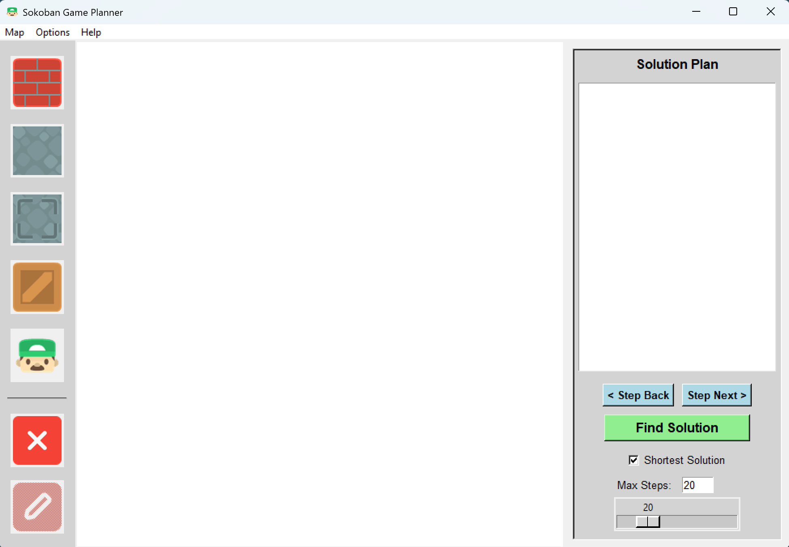
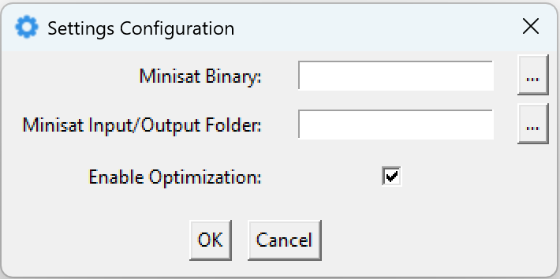
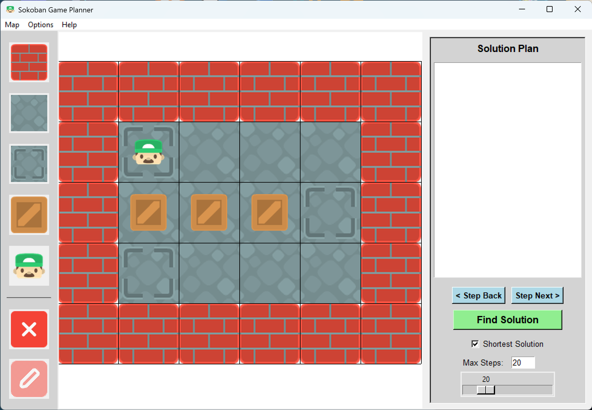
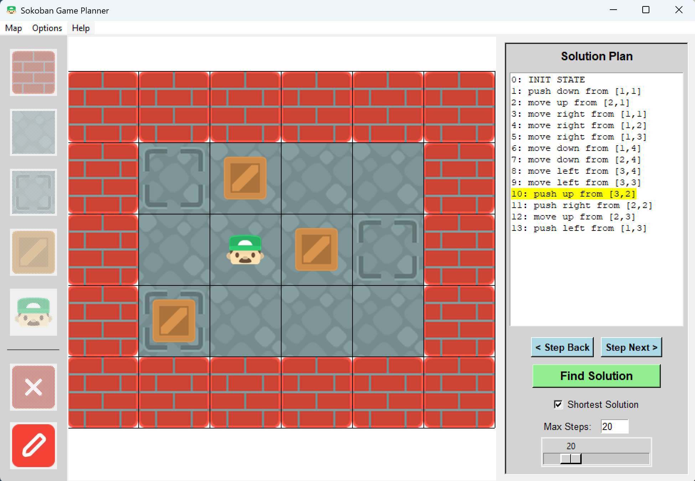

# Sokoban SAT Planner

This project implements a Sokoban puzzle solver based on SAT planning. It reads Sokoban map from a text file, compiles it into a propositional planning task (CNF), and runs an external SAT solver (MiniSat) repeatedly to search for the shortest plan.

It comes with both command-line interface and GUI (Tkinter-based) for visualizing the found plans step-by-step.


## Requirements

- **Python 3.7+**
- **NumPy library**
- **Pillow library** (only for GUI)
- **tkhtmlview library** (only for GUI)
- **MiniSat solver binary** (you will need to provide a path to an external MiniSat executable)


## Command-Line Usage

Run the solver as:

```
python code/sokoban.py [-h] [-O] [-s MAXSTEPS] [-i FILENAME] [-o FILENAME] [-r FILENAME] mapfile minisat
```

### Positional arguments

| Argument | Description |
|----------|-------------|
| `mapfile` | Path to the Sokoban map file. |
| `minisat` | Path to the MiniSat executable. |

### Options

| Switch | Description | Default |
|-|-|-|
| `-h`, `--help` | Show help message and exit. | None |
| `-O`, `--optimize` | Enable optimizations in the planning encoding. | None |
| `-s`, `--maxsteps` | Maximum number of steps to search for a solution. | `50` |
| `-i`, `--input` | File where the input for MiniSat will be stored. The file will be created/overwritten, so it need not exist beforehand. | `solver_input.cnf` |
| `-o`, `--output` | File where the output from MiniSat will be stored. The file will be created/overwritten, so it need not exist beforehand. | `solver_output.cnf` |
| `-r`, `--readable` | If provided, a human-readable version of the generated CNF will be saved to this file. | None |

> **Note:** After the script finishes, the file given via `--input` is overwritten with the DIMACS encoding for the last MiniSat invocation. This is either the formula for the maximum number of steps (specified with `--maxsteps`) or, if the planner found a solution sooner, the formula for the minimal step bound at which a solution existed. The same applies to the output file (`--output`) and readable CNF file 
(`--readable`).


### Example usage

```
python code/sokoban.py maps/map1.txt /usr/bin/minisat -O -s 20 -r encoding.txt
```

### Map Format

A map file is expected to consist of lines of characters representing different tiles in the map. We use the following representation:

| Char | Tile Type | Char | Tile Type |
|-|-|-|-|
| `S` | Sokoban | `s` | Sokoban on storage |
| `C` | crate | `c` | crate on storage |
| `X` | storage | `#` | wall |
| space | floor | | |

Map is padded with floors to make it rectangular if needed. There must be exactly one Sokoban on the map, and the number of crates must equal the number of storage locations.

#### <a name="example"></a>Example Map

```
######
#s   #
#CCCX#
#X   #
######
```

### Output

If a solution was found within the given step bound, it prints a sequence of actions chosen at each step. Actions are printed in the following format:

```
step: action direction from [x,y]
```

Where `action` is either `move` or `push`, `direction` is one of `up`, `down`, `left`, or `right`, `[x,y]` are the coordinates of the Sokoban before performing the action (`x` is row index, `y` is column index), and `step` is the time step (starting from `1`).

> **Note:** Description of chosen vocabulary can be found below in section [Vocabulary and Planning Encoding](#vocab).

#### Example Solution

Consider the [example map](#example) from above. The found solution would be:


```
1: push down from [1,1]
2: move up from [2,1]
3: move right from [1,1]
4: move right from [1,2]
5: move right from [1,3]
6: move down from [1,4]
7: move down from [2,4]
8: move left from [3,4]
9: move left from [3,3]
10: push up from [3,2]
11: push right from [2,2]
12: move up from [2,3]
13: push left from [1,3]
```


## GUI Usage

Run the GUI as:

```
python code/sokoban_gui.py
```

It will open the following window:



### Control Panel

The buttons in the control panel on the left side have the following functions:

| Button | Name | Description |
|-|-|-|
|  | Wall | Selects wall tile for placement. |
|  | Floor | Selects floor tile for placement. |
|  | Storage | Selects storage tile for placement. |
|  | Crate | Selects crate for placement. |
|  | Sokoban | Selects Sokoban for placement. |
|  | Clear | Clears the whole map. |
|  | Edit | Switches to edit mode (from solution mode). |


### Settings

You need to set the path to a MiniSat executable and to a folder for MiniSat input/output files. You can configure this by clicking **"Settings" -> "Configure"**, which opens a settings window. You can also enable/disable optimizations in the planning encoding here.




### Edit Mode

To create a new map, click **"Map" -> "New Map"** and enter the desired dimensions. Maximum map size is 20x20. Alternatively, you can load an existing map from a file by clicking **"Map" -> "Import"** and selecting a text file containing the map in the expected format.

You can then edit the map by selecting tools from the control panel and clicking on the grid to place selected tile/object. Use **right-click to erase an object** on a tile (Sokoban or crate).

You can export the current map to a text file by clicking **"Map" -> "Export"**.




### Solution Mode

When the map is ready, you can click on **"Find Solution"** button in the solution panel on the right. This will run the planner and, if a solution is found, display the plan. You can then use the **"Step Next"** and **"Step Back"** buttons to visualize the solution step-by-step on the grid.

Before clicking on "Find Solution", you can set the maximum number of steps for the planner to consider, and whether the planner should look for the shortest solution or any solution within the step limit.

While in solution mode, you cannot edit the map. To return to edit mode, click on the "Edit" button in the control panel (*WARNING: found plan will be erased*).




## <a name="vocab"></a>Vocabulary and Planning Encoding

> **Note:** This section describes the vocabulary and encoding for basic STRIPS-style planning without optimizations. See the documentation for details on optimizations implemented.

The planner uses a propositional SAT encoding with the following fluents and actions.

### Fluents

All positions are referenced by coordinates `(x,y)` on the Sokoban map grid. All maps are parsed as a rectangle grid, with position `(0,0)` as top-left corner, `x`-coordinate increasing right and `y`-coordinate increasing downward.

#### Static fluents

These do not change over time:

- `wall(x,y)` - cell `(x,y)` contains a wall
- `storage(x,y)` - cell `(x,y)` contains a storage

Any cell that is neither wall nor storage is ordinary floor.

#### Dynamic fluents

These are indexed by a time step `t`, representing the evolving game state:

- `crate(x,y,t)` - at time step `t`, a cell `(x,y)` contains a crate
- `sokoban(x,y,t)` - at time step `t`, the player (Sokoban) stands at cell `(x,y)`


### Actions

Actions are indexed by time step `t` and represent transitions of states from step `t` to step `t+1` (meaning the first action is assigned step `0`).

- `move(x,y,d,t)` - Sokoban is at position `(x,y)` at time `t` and moves into an adjacent free cell in direction `d` (`up`/`down`/`left`/`right`)

- `push(x,y,d,t)` - Sokoban is at position `(x,y)` at time `t` and pushes a crate located one cell ahead in direction `d`, moving both crate and Sokoban one step (e.g. `push(1,1,right,0)` means the Sokoban is at `(1,1)` and pushes a crate from `(2,1)` to `(3,1)`)

- `noop(t)` - represents "no operation" at time step `t`, (used to pad shorter plans, allowing binary search)

The following table contains preconditions and effects of these actions. Note that `(x',y')` is position one step from `(x,y)` in direction `d`, while `(x'',y'')` is two steps in that direction. Action `noop(t)` does not have any precoditions nor effects.

| Action | Preconditions | Effects |
|-|-|-|
| `move(x,y,d,t)` | `sokoban(x,y,t)` <br> `-wall(x',y',t)` <br> `-crate(x',y',t)` | `sokoban(x',y',t+1)` <br> `-sokoban(x,y,t+1)` |
| `push(x,y,d,t)` | `sokoban(x,y,t)` <br> `crate(x',y',t)` <br> `-wall(x'',y'',t)` <br> `-crate(x'',y'',t)` | `sokoban(x',y',t+1)` <br> `crate(x'',y'',t+1)` <br> `-sokoban(x,y,t+1)` <br> `-crate(x',y',t+1)` |
